# 🌌 Zenith Workspace + J.A.R.V.I.S AI Assistant

<p align="center">
  
  
  
  
  
  
</p>

A next-generation, fully comprehensive productivity dashboard integrating a modular, widget-based interface and a highly advanced Voice AI Assistant (J.A.R.V.I.S.). Powered by Next.js, React, and Google's Gemini 3.5 Flash Model.

---

## 🚀 Key Features

### 🧠 J.A.R.V.I.S Integration
- **Contextual Welcome Greeting:** Automatically greets you with a professional voice and reads out your pending daily tasks.
- **Microphone & Voice Input:** Harnesses the Web Speech API to provide accurate, real-time voice-to-text inputs.
- **Web-grounded Intelligence:** Integrates `Jina AI` behind the scenes to fetch the latest online news and web data dynamically.
- **Audio Visualizer:** A responsive, real-time wave visualizer that reacts to the user's voice intensity during input.
- **Text-to-Speech (TTS):** Communicates securely and clearly with customizable speech settings (Voice identity, playback rates).

### 🖥️ Dynamic Widgets (Drag & Drop)
- **World Clock:** Track time across the globe with live UTC indicators.
- **Task Manager / Agenda:** A beautiful daily tracker with offline local-storage persistence.
- **Pomodoro Timer:** Immersive focus cycles to maintain peak productivity throughout the day.
- **Live Weather & Currency:** Quick and accessible real-time stats directly on your dashboard.
- **Sortable Layout:** Uses `dnd-kit` to allow complete drag-and-drop modularity over your workspace widgets.
- **Theming Engine:** Instantly swap between core color modes (Emerald, Rose, Amber, Sky, Default/Cosmic).

---

## 🌊 Architecture & Data Flow

Below is the interaction flowchart outlining how user input travels through the frontend to the intelligence layer and back.

```mermaid
graph LR
    %% Styling
    classDef userAccess fill:#1e293b,stroke:#e2e8f0,stroke-width:2px,color:#fff
    classDef aiAgent fill:#0ea5e9,stroke:#0284c7,stroke-width:2px,color:#fff
    classDef logic fill:#6366f1,stroke:#4338ca,stroke-width:2px,color:#fff
    classDef output fill:#10b981,stroke:#059669,stroke-width:2px,color:#fff

    A([User Accesses Zenith Workspace]):::userAccess --> B{JARVIS Initialization}:::logic
    B -->|Analyzes State| C[Reads Local Storage Agenda]:::logic
    C --> D(Speaks Custom Welcome + Task Summary):::aiAgent
    D --> E[Dashboard Interactive Stage]:::userAccess
    
    %% Dashboard Flow
    E --> F[Adjust Widgets]
    E --> G[Run Pomodoro / Tasks]
    
    %% AI Flow
    E --> H([User Toggles Microphone]):::userAccess
    H --> I[Web Speech API Captures Audio]:::logic
    I --> J[Audio Visualizer Animates waveform]:::logic
    I --> K[Transcribes Voice to Text]:::logic
    K --> L[Next.js API Route /api/jarvis]:::logic
    
    %% Backend AI Processing
    L --> M{Requires live Web context?}:::logic
    M -->|Yes| N[Internal Tool Call: Jina.ai Search]:::aiAgent
    N --> O[Gemini 3.5 Flash Model Consumes Context]:::aiAgent
    M -->|No| O
    
    %% Final Outputs
    O --> P[Generates Conversational Output]:::aiAgent
    P --> Q[Frontend TTS Synthesis]:::output
    Q --> R([JARVIS Reacts & Speaks to User]):::output
```



---

## 🛠️ Installation & Setup

1. **Clone the project:**
   ```bash
   git clone https://github.com/dextryayers/zenith-dashboard.git
   cd zenith-workspace
   ```

2. **Install dependencies:**
   ```bash
   npm install
   ```

3. **Configure Environment variables:**
   Create a `.env` file in the root directory and add your Google Gemini API Key.
   ```env
   # .env
   GEMINI_API_KEY=your_gemini_api_key_here
   ```

4. **Run the Development Server:**
   ```bash
   npm run dev
   ```

5. **Interact:**
   Open [http://localhost:3000](http://localhost:3000) and click the **J.A.R.V.I.S** icon in the bottom right corner to begin.

---

## 🔒 Privacy & Data

- **Local First:** All tasks, themes, layouts, and clock preferences are securely saved entirely in your local browser (`localStorage`).
- **Server-Side API Keys:** The Gemini API keys are heavily fortified and never exposed onto the client-side payloads.
- **Voice Data:** Voice capture is temporary and channeled directly to our secure Next.JS endpoint purely for execution operations.

> *"Always at your service, Boss."* — J.A.R.V.I.S.
